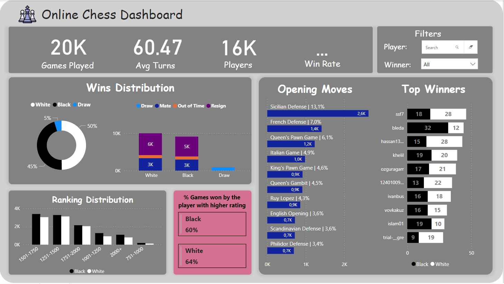
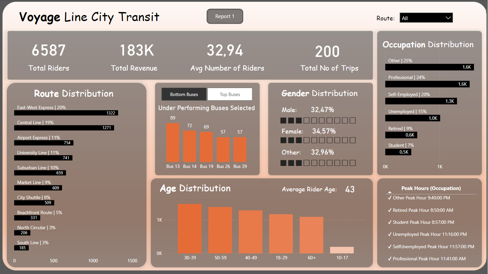
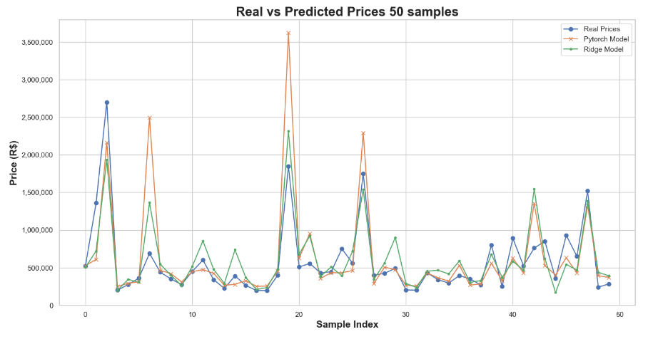
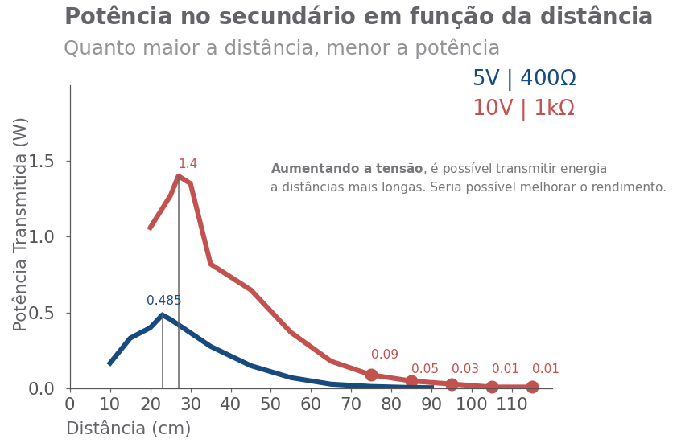

# Welcome to my Data Analysis and Data Science Portfolio!

# Power BI

## Chess Dashboard

### Overview

This dashboard presents insights from a dataset containing over 20,000 online chess matches played on Lichess. The dataset includes detailed information such as moves, winners, ratings, and opening details.

### Dataset Details

**Online Chess Matches**
- Data from over 20,000 chess matches played on Lichess, including moves, winners, ratings, opening details, and more.

### Analysis

1. **Winning Statistics:**
   - What percentage of matches were won by white? How many ended in a draw?

2. **Opening Moves:**
   - Which opening move was most frequently used in matches where black pieces won? And when white pieces won?

3. **Influence of Rating:**
   - What percentage of matches were won by the player with the highest rating? Does this vary based on the color of the pieces?

4. **Top Players Analysis:**
   - Which user won the highest number of matches? What percentage of those matches did the user have the highest rating?

Feel free to explore and visualize the data using the dashboard for more insights: [Chess Dashboard](https://app.powerbi.com/groups/me/reports/5ffa5a4b-f3fb-43af-b6f6-5c89dfac3e09/ReportSection?experience=power-bi)

---

## Transportation Dashboard

### Overview

This dashboard provides a comprehensive analysis of the transportation sector in the city. It covers details such as bus occupancy, popular routes, passenger demographics, and peak hours.

### Dataset Details

**City Transportation Data**
- Information on bus occupancy, routes, passenger demographics, and schedules.

### Analysis

1. **Bus Occupancy:**
   - Identify the most and least occupied buses.

2. **Route Analysis:**
   - Determine the busiest and least busy routes in the city.

3. **Passenger Demographics:**
   - Explore the age and occupation distribution among passengers to understand the target audience.

4. **Peak Hours:**
   - Identify the busiest and least busy times during the day.

Feel free to use the interactive features of the dashboard to delve deeper into your understanding of transportation data: [Transportation Dashboard](https://app.powerbi.com/groups/me/reports/e24ec4dc-153a-4f17-a636-0cd060aa7b93/ReportSection3944d937f29d2cc50171?experience=power-bi)

---

# Python

## Real Estate Price Prediction and Web Scraping Project

Predictive Analysis of Real Estate Prices

## Overview

This project involves the use of Robotic Process Automation (RPA) with UiPath to perform web scraping, extract real estate data, and subsequently use data science techniques for analysis and prediction. The main objectives include data collection, cleaning, exploration, and building a predictive model to estimate property prices based on various features such as the number of rooms, property type, parking spaces, and square footage.

## Project Description

### Web Scraping with UiPath

Using the RPA capabilities of UiPath, the project starts with web scraping to gather real estate data from online sources. UiPath is used to navigate web pages, extract relevant information, and store it in a structured format.

### Data Transformation with Excel

The extracted data is transferred to an Excel spreadsheet for further processing. This step involves organizing and formatting the data to prepare it for subsequent analyses.

### Data Cleaning and Exploration

With the data now in a usable format, the project proceeds to clean and explore the dataset. This involves handling missing values, outliers, and other inconsistencies. Exploratory data analysis (EDA) is performed to gain insights into the distribution and relationships within the dataset.

### Predictive Modeling with PyTorch

The core of the project involves building a predictive model using PyTorch, a deep learning framework. A neural network is designed and trained to predict property prices based on key features such as the number of rooms, property type, parking spaces, and square footage.

### Model Comparison

In addition to the neural network, a pre-trained regression model is used for comparative analysis. The performance of both models is evaluated to determine their effectiveness in predicting real estate prices.

See the repository at: [Real Estate Price Prediction Repository](https://github.com/GustavoG-bot/quinto_andartrain)

---

## Wireless Power Transfer (WPT) Project - Inductive Resonant Coupling

## Overview

Wireless Power Transfer (WPT), or Wireless Power Transfer, is a system for transmitting electrical power without the use of wires. Energy transfer occurs through a time-varying magnetic field generated by a transmitter circuit and received by a receiving device to be charged.

In this project, a specific WPT technology known as Inductive Resonant Coupling was studied. This system operates similarly to a transformer, where there are two separate coils. The primary coil, through a voltage source, transfers energy to the secondary where there is a coupled load. The difference from WPT compared to the transformer is the presence of capacitors in the primary and secondary, along with the self-inductances of the coils, making the system oscillatory for a certain resonance frequency. This frequency must be the same for both transmitter and receiver. If the system oscillates at the resonance frequency through a forced action, there will be energy transfer.

During the execution of this project, the following tasks were performed:

1. Adaptation of the transformer model for the study of the resonant WPT circuit;
2. Simulation of the WPT circuit model in Python and identification of the optimal transmission frequency for each load condition and magnetic coupling coefficient;
3. Assembly of a WPT circuit capable of wirelessly transmitting energy for a chosen application;
4. Presentation of simulation and validation results.

See the project repository at: [Wireless Power Transfer Repository](https://github.com/GustavoG-bot/WPTeletromag)

See more Python projects at:
- Pygame game: [Pygame Game Repository](https://github.com/GustavoG-bot/projetogamedessoft)
- Prediction of solar radiation levels: [Solar Radiation Prediction Repository](https://github.com/GustavoG-bot/projeto2data)
- Explore my repositories for more projects!

---

# SQL

## Sakila Database Analysis Project

This project uses the "sakila" database to perform analyses and answer various questions related to the movie rental store. The "sakila" database contains information about movies, customers, payments, actors, and other entities related to a fictional rental store.

## Questions Answered

1. **Number of Films Rented by Category and Total Revenue:**
   - Presents the total number of films rented by category, along with the total revenue generated by these rentals.

2. **Top-Spending Customers at the Store:**
   - Identifies the customers who spent the most at the store, listing their first names, last names, and total paid.

3. **Actors/Actresses Whose Name Starts with "A":**
   - Lists the actors and actresses whose names begin with the letter "A".

4. **Number of Films per Actor:**
   - Presents the total number of films each actor appeared in.

5. **Number of Films per Actor with Filter:**
   - Filters the actors who appeared in 35 or more films, presenting their names and the total number of films.

6. **Film Quantity per Inventory:**
   - Shows the quantity of films available in each inventory, along with the film titles.

7. **Top Customers for Specific Category:**
   - Identifies the top customers who rented films from the 'Action' category, listing their IDs, names, and the total rentals.

## Code (SQL)

Available in the repository: [Sakila Database Analysis Repository](https://github.com/GustavoG-bot/sql_train/tree/main)

---

# RPA

Robots developed using automation software called UiPath. Robots available at: [RPA Robots](https://drive.google.com/drive/folders/1z1asixySCBIEPo7rdZiDt7rKl1lYAnrJ)

Example: (insert real estate web scraping video)

---

# ABOUT

Hello! 😊

I'm a Mechatronics Engineering student at Insper, currently in the ninth semester. Since the beginning of my academic journey, I've been driven to explore different areas of engineering, all related to areas covered by my course, such as programming, robotics, electrical/electronics, control theory, mechanics, among others.

See also my portfolio of some projects in these areas: [My Portfolio](https://drive.google.com/drive/folders/1Fl73x_nhXwF1cUF_o1W-frHUlm11oCJU?usp=sharing)

--- 

# CONTACT

If you have any questions, comments, or wish to contact me, feel free to do so through the links below:

- Linkedin: [Gustavo Camargo](https://www.linkedin.com/in/gustavo-camargoin/)
- Github: [GustavoG-bot](https://github.com/GustavoG-bot)
- Kaggle: [guedes5132](https://www.kaggle.com/guedes5132)
